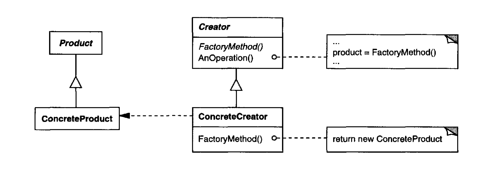

# Design Patterns TypeScript Implementation

---

### Table of Contents

- [Creational Patterns](#creational-patterns)
  - [Abstract Factory](#abstract-factory)
  - [Builder](#builder)
  - [Factory Method](#factory-method)
  - [Prototype](#prototype)
---

## Creational Patterns
> Creational design patterns abstract the instantiation process. They help make a system
independent of how its objects are created, composed, and represented. A class creational
pattern uses inheritance to vary the class that's instantiated, whereas an object
creational pattern will delegate instantiation to another object. 

#### Abstract Factory
> Provide an interface for creating famili es of related or dependent objects without
specifying their concrete classes. 

##### Applicability:
- when a system should be independent o f how its products are created, composed,
and represented.
- when a system should be configured with one o fmultiple famili es of products
- when a family of related product objects is designed to be used together, and you
need to enforce th is constraint
- whenyou want to provide a class library of products, and you want to reve al just
their interface, not their implementations

##### Structure

##### Partecipants
- AbstractFactory
  - declares an interface for operations that create abstract product objects
- ConcreteFactory
  - implements the operations to create concrete product objects
- AbstractProduct
  - declares an interface for a type of product object
- ConcreteProduct
  - defines a product object to becreated by the corresponding concrete factory
  - implements the AbstractProduct interface                                               
- Client
  - uses only interfaces declared by AbstractFactory and AbstractProduct
classes

##### Usage

Open a terminal in the abstract_factory folder and run the client file using the command `tsc client.ts` and then run the created javascript file using the command `node client.js`. TypeScript and Node are required!.

### Builder
>Separate the construction of a complex object from its representation so that the
same construction process can create different representations

##### Applicability
- use when the algorithm for creating a complex object should be independent of the parts that make up the object and how they're assembled
- use when the construction process must allow different representations for the object that's constructed

##### Structure

##### Participants

- Builder
  - specifies an abstract interface for creating parts of a Product object
- ConcreteBuilder
  - constructs and assembles parts of the product by implementing the Builder
interface
  - defines and keeps track of the representation it creates
  - provides an interface for retrieving the product
- Director
  - constructs an object using the Builder interface
- Product
  - represents the complex object under construction. ConcreteBuilder builds the product's internal representation and defines the process by which it's assembled
  - includes classes that define the constituent parts, including interfaces for assembling the parts into the final result

##### Usage

Open a terminal in the builder folder and run the client file using the command `tsc client.ts` and then run the created javascript file using the command `node client.js`. TypeScript and Node are required!

### Factory Method
>Define an interface for creating an object, but let subclasses decide which class to instantiate. Factory Method lets a class defer instantiation to subclasses

##### Applicability
- when a class can't anticipate the class of objects it must create
- when a class wants its subclasses to specify the objects it creates
- when classes delegate responsibility to one of several helper subclasses, and you want to localize the knowledge of which helper subclass is the delegate

##### Structure

##### Participants

- Product
  - defines the interface of objects the factory method creates
- ConcreteProduct
  - implements theProduct interface
- Creator
  - declares the factory method, which returns an object of type Product. Creator may also define a default implementation of the factory method that returns a default ConcreteProduct object
  - may call the factory method to create a Product object
- ConcreteCreator
  - overrides the factory method to return an instance of a Concrete Product

##### Usage

Open a terminal in the factory_method folder and run the client file using the command `tsc client.ts` and then run the created javascript file using the command `node client.js`. TypeScript and Node are required!

#### Prototype
> Specify the kinds of objects to crea te using a prototypical instance, and create new objects by copying this prototype

##### Applicability:
- when the classes to instantiate are specified at run-time, for example, by dynamic loading
- to avoid building a class hierarchy of factories that parallels the class hierarchy of products
- when instances of a class can have one of only a few different combinations of state. It may be more convenient to install a corresponding number of prototypes and clone them rather than instantiating the class manually, each time with the appropriate state

##### Structure

##### Partecipants
- Prototype
  - declares an interface for cloning itself
- ConcretePrototype
  - implements a noperati on for cloning itself
- Client
  - creates a new object by asking a prototype to clone itself

##### Usage

Open a terminal in the prototype folder and run the following command to install the required dependencies `npm install @types/node`. Run the client file using the command `tsc client.ts` and then run the created javascript file using the command `node client.js`. TypeScript and Node are required!

#### Singleton
> Ensure a class only has one instance, and provide a global point of access to it

##### Applicability:
- there must be exactly one instance of a class, and it must be accessible to clients from a well-known access point
- when the sole instance should be extensible by subclassing, and clients should be able to use an extended instance without modifying their code

##### Structure

##### Partecipants
- Singleton
  - defines an Instance operation that lets clients access its unique instance. Instance is a class operation
  - may be responsible for creating its own unique instance

##### Usage

Open a terminal in the singleton folder and run the following command to install the required dependencies `npm install esm`. Run the client file using the command `tsc -t es6 client.ts` and then run the created javascript file using the command `node -r esm client.js`. TypeScript and Node are required!

---

## References

<pre>
All the above informations are cited from the book  <b style="color: red;">Design Patterns: Elements of Reusable Object-Oriented Software</b>.
</pre>
---

## License

MIT License

Permission is hereby granted, free of charge, to any person obtaining a copy
of this software and associated documentation files (the "Software"), to deal
in the Software without restriction, including without limitation the rights
to use, copy, modify, merge, publish, distribute, sublicense, and/or sell
copies of the Software, and to permit persons to whom the Software is
furnished to do so, subject to the following conditions:

The above copyright notice and this permission notice shall be included in all
copies or substantial portions of the Software.

THE SOFTWARE IS PROVIDED "AS IS", WITHOUT WARRANTY OF ANY KIND, EXPRESS OR
IMPLIED, INCLUDING BUT NOT LIMITED TO THE WARRANTIES OF MERCHANTABILITY,
FITNESS FOR A PARTICULAR PURPOSE AND NONINFRINGEMENT. IN NO EVENT SHALL THE
AUTHORS OR COPYRIGHT HOLDERS BE LIABLE FOR ANY CLAIM, DAMAGES OR OTHER
LIABILITY, WHETHER IN AN ACTION OF CONTRACT, TORT OR OTHERWISE, ARISING FROM,
OUT OF OR IN CONNECTION WITH THE SOFTWARE OR THE USE OR OTHER DEALINGS IN THE
SOFTWARE.

